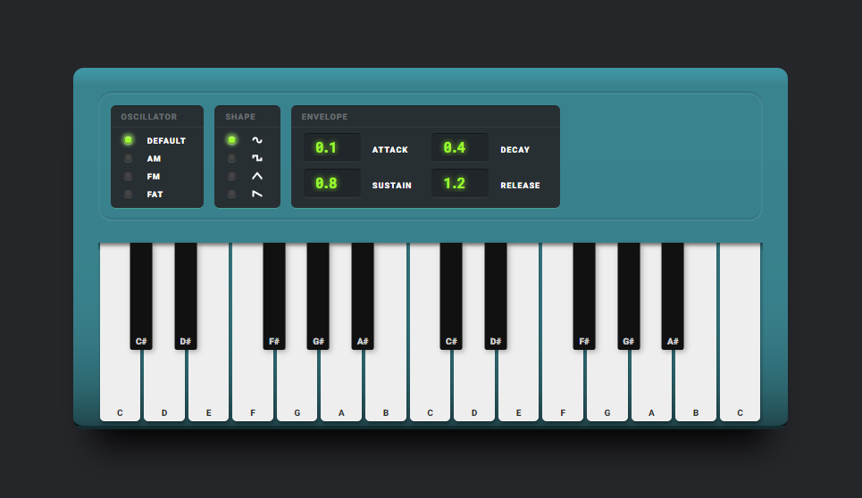
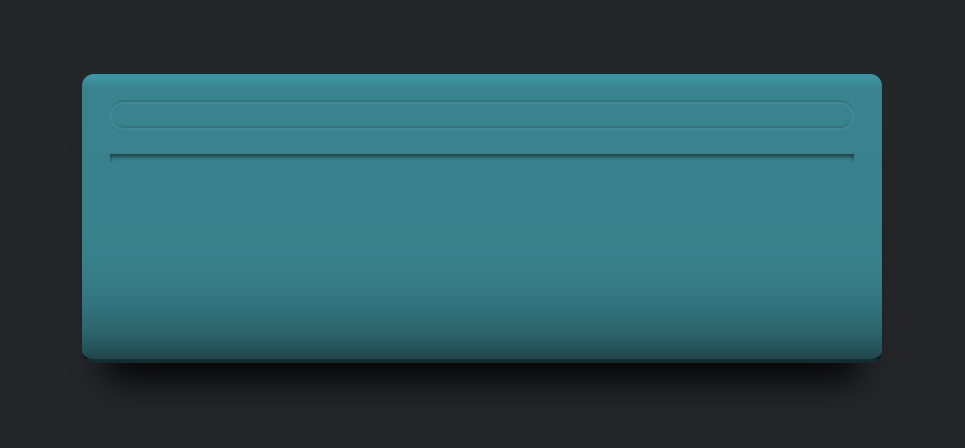
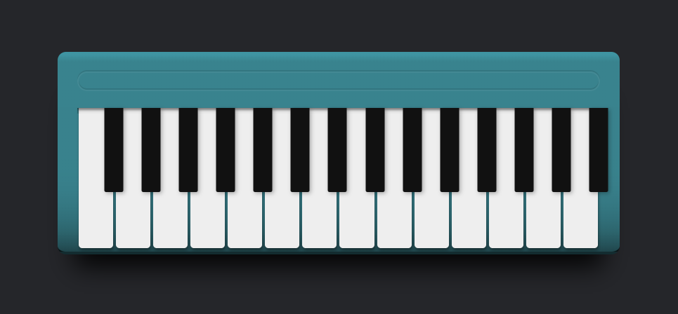
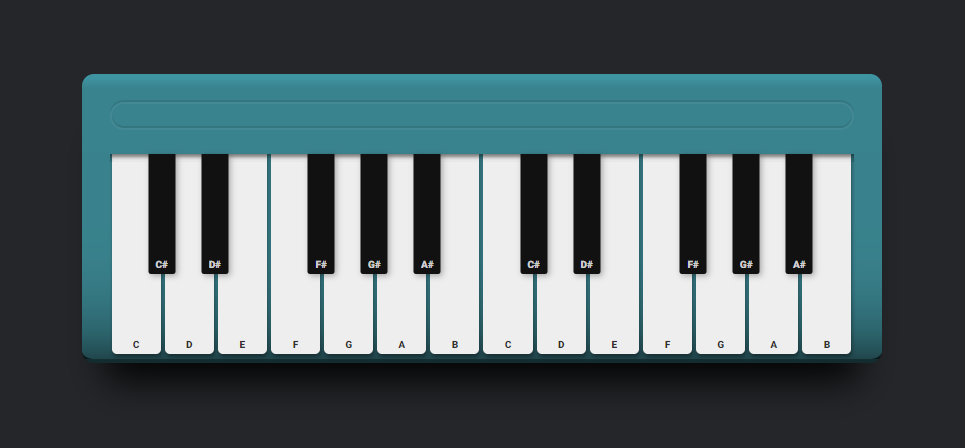
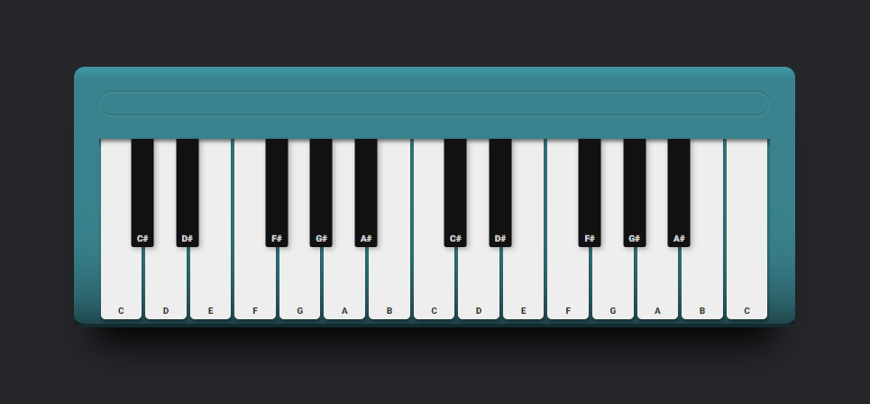
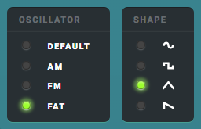
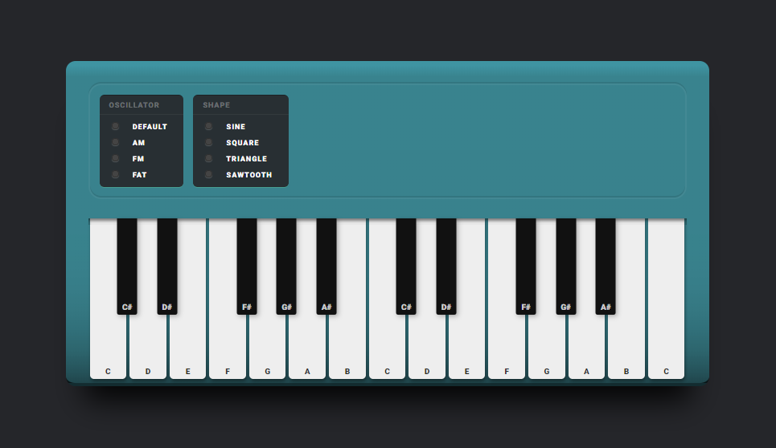
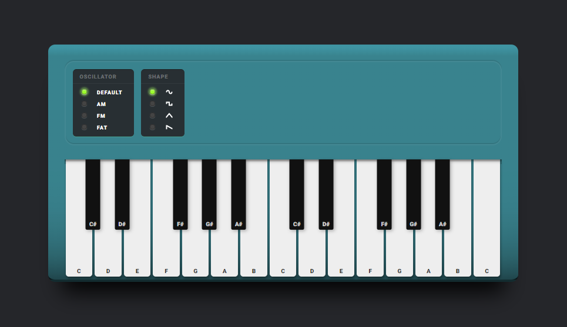
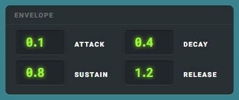

# Browser Synth <!-- omit in toc -->

We are going to build this little browser synth with JavaScript and [ToneJS](https://tonejs.github.io/).

Live version at https://donmckenna.github.io/fireship.io-browser-synth



[ToneJS](https://tonejs.github.io/) is a JavaScript library which abstracts the [Web Audio API](https://developer.mozilla.org/en-US/docs/Web/API/Web_Audio_API) out into a more musical syntax.   
We're going to use some of its [built-in oscillators and envelope adjustments](https://github.com/Tonejs/Tone.js#instruments) to play with the sound of our synth as we play it, and we'll put it all together with vanilla `JavaScript`, `CSS` and `HTML`.

ToneJS-specific features we'll use:

- Instantiate a synth with [`Tone.Synth()`](https://tonejs.github.io/docs/13.8.25/Synth) and hook it up to our output audio.
- Build out template buttons to trigger notes with [`Tone.Synth.triggerAttackRelease()`](https://tonejs.github.io/docs/13.8.25/Synth#triggerattackrelease)
- Build out template inputs to alter synth oscillators and envelope parameters by assigning values to [`Tone.Synth().oscillator`](https://tonejs.github.io/docs/13.8.25/Synth#oscillator) and [`Tone.Synth().envelope`](https://tonejs.github.io/docs/13.8.25/Synth#envelope)
- Understand the parameters each of these options takes and why.

This article can be digested in 3 chunks:
- [1. Build a keyboad and use it to play ToneJS notes](#1-build-a-keyboad-and-use-it-to-play-tonejs-notes)
    - [Initialize `index.html`](#initialize-indexhtml)
    - [Initialize `synth.js`](#initialize-synthjs)
    - [Building the keyboard](#building-the-keyboard)
    - [Account for layout edge cases](#account-for-layout-edge-cases)
    - [Add root note of final octave](#add-root-note-of-final-octave)
- [2. Hook oscillator option groups into synth chain](#2-hook-oscillator-option-groups-into-synth-chain)
    - [Set up oscillator template options](#set-up-oscillator-template-options)
    - [Set up oscillator variable options](#set-up-oscillator-variable-options)
    - [Creating Option Groups](#creating-option-groups)
    - [Creating Options](#creating-options)
    - [Updating the Oscillator](#updating-the-oscillator)
    - [Tighten up UI with SVGs](#tighten-up-ui-with-svgs)
    - [Auto-check default radio options](#auto-check-default-radio-options)
- [3. Expand oscillator option group to accommodate different `<input>` types](#3-expand-oscillator-option-group-to-accommodate-different-input-types)
    - [Refactor options variable](#refactor-options-variable)
    - [Refactor `createOptionGroup()`](#refactor-createoptiongroup)
    - [Refactor `createOption()`](#refactor-createoption)
    - [Refactor `updateOscillator()`](#refactor-updateoscillator)
    - [Fin](#fin)

<hr>


## 1. Build a keyboad and use it to play ToneJS notes

#### Initialize `index.html`

`index.html` isn't too special but we'll break down the special parts below.

```html
<!DOCTYPE html>
  <head>
    <meta charset="utf-8">
    <title>Pocket Synth</title>
    <meta name="viewport" content="width=device-width, initial-scale=1">
    <link rel="stylesheet" href="styles.css">
    <script src="https://cdnjs.cloudflare.com/ajax/libs/tone/13.8.25/Tone.js"></script>
  </head>

  <body>
    <div class="synth">
      <div id="options-container"></div>
      <div id="synth-keys-container"></div>
    </div>
  </body>

  <script src="synth.js"></script>
</html>
```


Inside the `<head>` tags, we can bring in `Tone.js` from [cdnjs](https://cdnjs.com/libraries/tone/13.8.25).  
The version this article uses is `13.8.25`, but you can check for updates [**here**](https://github.com/Tonejs/Tone.js/releases).

```html
<head>
  <script src="https://cdnjs.cloudflare.com/ajax/libs/tone/13.8.25/Tone.js"></script>
  ...
</head>
```

After the closing `<body>` tag we can bring in the `synth.js` file we're about to create.

```html
<html>
  <head> ... </head>
  <body> ... </body>

  <script src="synth.js"></script>
  
</html>
```

And inside the `<body>` tags, we can add the scaffolding we'll paint our `JavaScript` on.

```html
<body>

  <div class="synth">
    <div id="options-container"></div>
    <div id="synth-keys-container"></div>
  </div>

</body>
```

Your `html` and `css` should make this exciting container.




<hr>

#### Initialize `synth.js`

Now we can create our `synth.js` file.

Inside, we'll instantiate a new [`Synth()`](https://tonejs.github.io/docs/13.8.25/Synth) from [`Tone`](https://tonejs.github.io/docs/13.8.25/Tone), and port its audio output to the playing computer's default master audio output, with [`.toMaster()`](https://tonejs.github.io/docs/13.8.25/Synth#tomaster).   
Without [`.toMaster()`](https://tonejs.github.io/docs/13.8.25/Synth#tomaster) ToneJS won't know where to send its output and we won't hear anything.

```javascript
const synth = new Tone.Synth().toMaster();
```

Our [`Tone.Synth()`](https://tonejs.github.io/docs/13.8.25/Synth) has a method on it called [`triggerAttackRelease()`](https://tonejs.github.io/docs/13.8.25/Synth#triggerattackrelease).   
Think of [`Attack`](https://tonejs.github.io/docs/13.8.25/Synth#triggerattack) as the start of a note and [`Release`](https://tonejs.github.io/docs/13.8.25/Synth#triggerrelease) as the end of its held duration.

We can trigger this method with a small `synthKeyPress()` function.

```javascript
const synthKeyPress = note => {
  synth.triggerAttackRelease(note, '16n');
};
```

The parameters we're passing into [`triggerAttackRelease()`](https://tonejs.github.io/docs/13.8.25/Synth#triggerattackrelease) are the note to be played (`C4`) and the subdivision of the note within its measure (`16n`).

`C4` means we're playing a `C` note on the `4`th lowest audible octave.   
`16n` means the note subdivision is a `16`th `n`ote.

You can read more about ToneJS [notes / Frequency Type **here**](https://tonejs.github.io/docs/13.8.25/Type#frequency)

> To better understand ToneJS's syntax, alternative accepted values could be:  
> `D6` to play a `D` note `2` octaves higher than a `C4`.   
> `4n` to play a quarter `n`ote subdivision.   
> `8t` to play an `8`th note `t`riplet subdivision.

<hr>

#### Building the keyboard

We'll keep track of our `synth-keys-container` and `options-container` `div`s to append generated keys and options to later.

```javascript
const optionsContainer = document.getElementById('options-container');
const synthKeysContainer = document.getElementById('synth-keys-container');
```

There are `12` notes in an octave. From `A` to `G` with all but 2 notes possessing a sharp (#).   
We can translate this to an array of root notes to loop through and generate white and black keys with.

```javascript
const notes = ['C', 'D', 'E', 'F', 'G', 'A', 'B'];
```

We'll also set how many octaves we'd like our synth to have, and what the lowest of these octaves should be.

```javascript
const octaveCount = 2;
const lowOctave = 5;
```

...where `octaveCount` is the number of total playable octaves, and `lowOctave` is the number of the lowest playable octave (like the numeric suffix on `C4` or `D6`, etc.)   
> For example, the above variables are saying our synth will have `2` octaves which will be octaves `5` and `6`.

Let's create a new function to loop through our notes and octaves and construct our synth keyboard.   
Loop over the `octaveCount` and increment through each iteration to later pass to our key presses. 

```javascript
const initializeSynthKeys = () => {
  let currentOctave = lowOctave;
  for (let i = 0; i < octaveCount; i++) {
    currentOctave++;
  }
}
```

Within each octave loop we'll also loop through the notes of the scale we defined earlier and construct some appendable `div`s to organize the layout of our keys.

For each key we'll trigger a function on `mousedown` called `synthKeyPress()` which will send the appropriate note and octave data to our [`Tone.Synth()`](https://tonejs.github.io/docs/13.8.25/Synth) to play.

We'll append each to a container variable `synthKeys` which will become the `innerHTML` of our `synthKeysContainer`, and we'll stick each white/black key pair inside a `<div class="key-group">` container for easier `CSS` positioning.   
Additionally, each key shares a `key` CSS class and has its own `white` or `black` class to differentiate the two.

Updated `initializeSynthKeys()`:

```javascript
const initializeSynthKeys = () => {

  let synthKeys = '';
  
  let currentOctave = lowOctave;
  for (let i = 0; i < octaveCount; i++) {

    for (let note of notes) {
      synthKeys += `
        <div class="key-group">
          <div class="key white" onmousedown="synthKeyPress('${note}${currentOctave}')"></div>
          <div class="key black" onmousedown="synthKeyPress('${note}${currentOctave}')"></div>
        </div>`;
    }

    currentOctave++;
  }
  synthKeysContainer.innerHTML = synthKeys;
}
```


We'll make a function called `initializeSynth()` to trigger the entire keyboard building process.   
It only calls `initializeSynthKeys()` right now but we can expand it later.

```javascript
const initializeSynth = () => {
  initializeSynthKeys();
};

initializeSynth();
```

And now it should look like this:



Better than nothing I suppose..

#### Account for layout edge cases

We still need to account for root notes which don't possess a sibling black key, and that `<div class="key">` repetition is a bit clunky so let's refactor this a bit and extract out the functionality to create any sort of key.

We can write a function which can create a white **or** black key.   
This function takes in the `color` of the desired key, its `note` and `octave`.

> Note the single quotes `''` around `${note}${octave}`. We're using template literal syntax, combining `note` and `octave` to make a new string to pass to `synthKeyPress()`, so it's important we pass in an explicit string and not the variables themselves.

> Also note the inclusion of `${note}` inside the `<div>` which prints the name of the note on the key itself.

```javascript
const createKey = (color, note, octave) => {
  note = color === 'black' ? note + '#' : note;
  return `
    <div class="key ${color}" onmousedown="synthKeyPress('${note}${octave}')">
      ${note}
    </div>`;
};
```

We have a ternary seeing if the value of `color` is `black` or not, and adding a sharp (`#`) to the played note if it is.   
The template string didn't change much, but it now uses the appropriate variables and its `color` class can be easily changed.

Let's update `initializeSynthKeys()` to use our new `createKey()` function.

```javascript
const initializeSynthKeys = () => {
  ...

    `<div class="key-group">
      ${createKey('white', note, currentOctave)}
      ${createKey('black', note, currentOctave)}
    </div>`;

  ...
}
```


Next, we can again write a small ternary helper function to tell us if the currently-being-constructed note has a sharp or not (`E` and `B` don't have sharps) and only create a black key (sharp key) if it does.

```javascript
const noteHasSharp = note => note !== 'E' && note !== 'B';
```

> This is similar to writing something like this..
> ```javascript
> const noteHasSharp = function(note) {
>   return (note !== 'E') && (note !== 'B');
> };
> ```
> ... (with some minor differences) but it can fit on one line.

And now we can use this helper function in another ternary to determine if a black key should be created.

```javascript
const initializeSynthKeys = () => {
  ...

    `<div class="key-group">
      ${createKey('white', note, currentOctave)}
      ${noteHasSharp(note) ? createKey('black', note, currentOctave) : ''}
    </div>`;

  ...
}
```

Which should look like this:



#### Add root note of final octave

To finish our keyboard, right before applying the `innerHTML`, we'll top off the octaves with a single, resolving `high C` white key, using the `currentOctave` variable we made earlier.

```javascript
const initializeSynthKeys = () => {
  ...

  synthKeys += `
    <div class="key-group">
      ${createKey('white', 'C', currentOctave)}
    </div>`;

  synthKeysContainer.innerHTML = synthKeys;
}
```

The finished `initializeSynthKeys()` should look something like this:

```javascript
const initializeSynthKeys = () => {
  let synthKeys = '';
  let currentOctave = lowOctave;

  for (let i = 0; i < octaveCount; i++) {
    for (let note of notes) {

      synthKeys += `
        <div class="key-group">
          ${createKey('white', note, currentOctave)}
          ${noteHasSharp(note) ? createKey('black', note, currentOctave) : ''}
        </div>`;

    }
    currentOctave++;
  }

  synthKeys += `
    <div class="key-group">
      ${createKey('white', 'C', currentOctave)}
    </div>`;

  synthKeysContainer.innerHTML = synthKeys;
};
```


Refresh your page and your browser synth should look like this:



And you should actually be able to play it.

And we could totally stop there.   
We could.  
But we won't.


<hr>

## 2. Hook oscillator option groups into synth chain




"Great," you say, "I've built a browser synth with only one timbre, but how can I add more variety to my oscillato-"   
LESS TALK, MORE CODE.

#### Set up oscillator template options

Let's create an object housing different values we can apply to our synth oscillator.
ToneJS offers a multitude of oscillator options and combinations, but we'll stick with basics here.

```javascript
const optionsList = [{
    title: 'Oscillator',
    type: 'type',
    values: ['default', 'am', 'fm', 'fat']
  }, {
    title: 'Shape',
    type: 'shape',
    values: ['sine', 'square', 'triangle', 'sawtooth']
  }];
```

The 4 main ToneJS oscillator wave shapes we'll use are `sine`, `square`, `triangle` and `sawtooth`.   
Each of these shapes can accept an oscillator `type` prefix of `am`, `fm`, or `fat`, offering oscillator types within types.   
Combining these, we effectively have 16 unique oscillators to play with.

We can build 2 sets of radio inputs from this object to combine these values into a string which ToneJS will accept for the synth oscillator `type`.

> Synth oscillator `type` examples:  
> `sine`  
> `amsquare`  
> `fatsawtooth`

You can learn more about `type` options by reading the [`.type` Oscillator member **here**](https://tonejs.github.io/docs/13.8.25/OmniOscillator#spread)

#### Set up oscillator variable options

We'll make an `oscillatorVars` object to keep track of oscillator type prefixes, and a `synthVars` object which contains the oscillator and envelope settings we'll reference and update later.   
These settings can be passed right into our [`Tone.Synth()`](https://tonejs.github.io/docs/13.8.25/Synth) we made earlier.

```javascript
const oscillatorVars = {
  type: '',
  shape: 'sine'
};

let synthVars = {
  oscillator : {
    type : 'sine',
  },
  envelope : {
    attack : 0.1,
    decay : 0.4,
    sustain : 0.8,
    release : 1.2,
  }
};

const synth = new Tone.Synth( synthVars ).toMaster();
```

#### Creating Option Groups


We'll define a function which creates an option group (via a function we'll create soon) for each option in `optionsList` and appends it to the `optionsContainer` `div` which we defined earlier.

```javascript
const initializeSynthOptions = () => {
  let options = '';
  for (let option of optionsList) {

    options += createOptionGroup(option.type, option.values, option.title);

  }
  optionsContainer.innerHTML = options;
};
```

...which we'll call alongside `initializeSynthKeys()` inside our `initializeSynth()` function at the end of `synth.js`.

```javascript
const initializeSynth = () => {
  initializeSynthKeys();
  initializeSynthOptions();
};

initializeSynth();
```

Similar to `initializeSynthOptions()`, we can create options with values from the `option.values` array, and build the template container for each option group.

```javascript
const createOptionGroup = (type, values, title) => {
let options = '';

for (const value of values) {
  options += createOption(type, value);
}

return `
  <div class="options">
    <span class="options-title">${title}</span>
    ${options}
  </div>`;
};
```

#### Creating Options

For each value we'll create an option passing in the option `type` ("option group type") and its `value`, using `type` to name our radio button and pass to `updateOscillator()` when the input has changed (`onchange`), and using `value` set the `<input>` value and `<label>` text.

```javascript
const createOption = (type, value) => {
  return `
    <label>
      <input
        type="radio"
        name="osc-${type}"
        value="${value}"
        onchange="updateOscillator('${type}', this.value)" />
      ${value}
    </label>`;
};
```

#### Updating the Oscillator

Next we can create the `updateOscillator()` function which will update the `synth.oscillator.type` with our `<input>`'s value when we switch radio options. We can update ToneJS synth parameters by simply assigning their values with `=`.

This function will also update `synthVars.oscillator` and `oscillatorVars` with the `type` and `value` to keep track of for future prefix / shape combinations.

```javascript
const updateOscillator = (type, value) => {
  oscillatorVars[type] = value;
  synthVars.oscillator[type] = value;
  synth.oscillator.type = `${oscillatorVars.type}${oscillatorVars.shape}`;
};
```

An edge case we have to account for is the `'default'` oscillator `type`. ToneJS doesn't need a prefix for its default state, but we probably want to provide something more descriptive than an empty string `''`, so let's add a check to convert a `'default'` `type` value into the empty string `''` ToneJS will work with.

```javascript
const updateOscillator = (type, value) => {

  if (type === 'type' && value === 'default') value = '';

  oscillatorVars[type] = value;
  synthVars.oscillator[type] = value;
  synth.oscillator.type = `${oscillatorVars.type}${oscillatorVars.shape}`;
};
```

Now we can save, refresh and ooo, look at those oscillator options :drool:




#### Tighten up UI with SVGs

Some `svg` images would better convey the `shape` group options though, don't you think?   
Let's add a ternary to account for this option, as well as update the variable the `<label>` uses for its content text.

```javascript
const createOption = (type, value) => {

  const valueContent = (type === 'shape') ? `` : value;

  return `
    <label>
      <input
        type="radio"
        name="osc-${type}"
        value="${value}"
        onchange="updateOscillator('${type}', this.value)" />

      ${valueContent}

    </label>`;
};
```
That's the stuff.


#### Auto-check default radio options

As a final order of business for the radio inputs, let's ensure the first default options are `checked`.

There are many ways we could accomplish this, but here we'll just pass in the `index` from the `values` array inside `createOptionGroup()`, and append the additional `checked` option for the 0th index within `createOption()`.

If we want to maintain the `for.. of` structure inside `createOptionGroup()`, instead of getting the `value` directly from the `values` array, we can destructure the `.entries()` method found on the `values` array, and extract its `value` **and** `index` from there instead, passing both into `createOption()` to assess.

The updated `createOptionGroup()` `for` loop should now look something like this:

```javascript
const createOptionGroup = (type, values, title) => {
  let options = '';

  for (const [i, value] of values.entries()) {
    options += createOption(type, value, i);
  }

  return `
    <div class="options">
      <span class="options-title">${title}</span>
      ${options}
    </div>`;
};
```

The updated `createOption()` which determines the first radio option `checked` state, should now look something like this:

```javascript
const createOption = (type, value, i) => {
  const valueContent = (type === 'shape') ? `` : value;

  let additionalOptions = '';
  if (i === 0) additionalOptions = 'checked'
  
  return `
    <label>
      <input
        type="radio"
        name="osc-${type}"
        value="${value}"
        onchange="updateOscillator('${type}', this.value)"

        ${additionalOptions} />

      ${valueContent}
    </label>`;
};
```

Loops within loops.   
Save. Refresh. Wonderful. 




<hr>

## 3. Expand oscillator option group to accommodate different `<input>` types




We'll have one last bit of fun and add some number inputs to mess with the oscillator's `attack`, `decay`, `sustain` and `release` envelopes.

You can read more about these [envelope values **here**](https://tonejs.github.io/docs/13.8.25/AmplitudeEnvelope)

Let's refactor one last time and try to reuse some of these functions to include `envelope` number inputs as well as `radio` inputs.

#### Refactor options variable

Update `optionsList` wth these new `envelope` options.

```javascript
const optionsList = [{
    title: 'Oscillator',
    type: 'type',
    values: ['default', 'am', 'fm', 'fat']
  }, {
    title: 'Shape',
    type: 'shape',
    values: ['sine', 'square', 'triangle', 'sawtooth']
  }, {

    title: 'Envelope',
    type: 'envelope',
    values: ['attack', 'decay', 'sustain', 'release']

  }];
  ```

This list is then consumed by `initializeSynthOptions()` which itself doesn't need to change, but calls `createOptionGroup()` which needs to update its styles a bit to account for the new `number input` the `envelope` option group requires.

#### Refactor `createOptionGroup()`

We'll add an `'envelope'` class to the outer `<div>` if we detect the given `type`'s value to be `'envelope'`, and an empty string if it's anything other than `'envelope'`.  Then just add this variable to the outer `<div>`.

`createOptionGroup()` should now look something like this:

```javascript
const createOptionGroup = (type, values, title) => {

  let envelopeClass = (type === 'envelope') ? type : '';

  let options = '';
  for (const [i, value] of values.entries()) {
    options += createOption(type, value, i);
  }
  return `

    <div class="options ${envelopeClass}">

      <span class="options-title">${title}</span>
      ${options}
    </div>`;
};
```

#### Refactor `createOption()`

`createOption()` is the function which renders the `radio` `<input>` we now want to conditionally render as either a `number` **or** `radio` `<input>`.

Let's expand this function's capabilities just a bit more and add a check for our `'envelope'` `type`.

```javascript
const createOption = (type, value, i) => {
  const valueContent = (type === 'shape') ? `` : value;

  let envelope = '';
  let inputType = 'radio';
  let additionalOptions = '';
  let valueAttribute = value;

  if (type === 'envelope') {
    envelope = value;
    inputType = 'number';
    additionalOptions = 'step="0.1" min="0.1"';
    valueAttribute = synthVars.envelope[value];
  
  // We know the type will end up being a radio option
  // when not an 'envelope'
  } else {
    if (i === 0) additionalOptions = 'checked'
  }
  
  return `
    <label>
      <input
        type="${inputType}"
        name="osc-${type}"
        value="${valueAttribute}"
        onchange="updateOscillator('${type}', this.value, '${envelope}')"
        ${additionalOptions} />
      ${valueContent}
    </label>`;
};
```

Here we've checked if the `type` is `'envelope'`, if it is we update the variables which the returned template consumes.   

- `radio` inputs only need to consume the `type` itself. But for the `'envelope'` we also need to pass in the `value`. Here we store that in `envelope` which we pass to `updateOscillator()`.

- Change `inputType` from `'radio'` to `'number'`.

- `additionalOptions` is just an arbitrary string you can add to your DOM element. Here it serves the sole purpose of constraining the `number` `<input>`'s steps and minimum value.

- Instead of passing `value` directly to the `<input>`'s value, we'll grab the entry from `synthVars.envelope`, and differentiate this new value from `value` and `valueContent` by naming it `valueAttribute`.


#### Refactor `updateOscillator()`

Finally, since oscillator `type`s and oscillator `envelope`s update slightly different values, we'll abstract their functionalities into two separate functions, `updateOscillatorType()` and `updateOscillatorEnvelope()`, and `updateOscillator()` can decide which to call.

`updateOscillator()` effectively becomes `updateOscillatorType()`

```javascript
const updateOscillatorType = (type, value) => {
  if (type === 'type' && value === 'default') value = '';
  oscillatorVars[type] = value;
  synthVars.oscillator[type] = value;
  synth.oscillator.type = `${oscillatorVars.type}${oscillatorVars.shape}`;
};
```

`updateOscillatorEnvelope()` can copy `updateOscillatorType()`'s structure, but will use the value of `envelope` instead of `type`. First it updates our global values to reference later, then assigns the specified `envelope` `value` to the `synth`.

```javascript
const updateOscillatorEnvelope = (envelope, value) => {
  synthVars.envelope[envelope] = value;
  synth.envelope[envelope] = value;
};
```

`updateOscillator()` now just needs to call `updateOscillatorEnvelope()` if there is an `envelope` value to update, otherwise it can continue calling `updateOscillatorType()`.

```javascript
const updateOscillator = (type, value, envelope) => {
  if (envelope) updateOscillatorEnvelope(envelope, value);
  else updateOscillatorType(type, value);
};
```


#### Fin

Now we can change our envelope values, oscillator combinations, and play notes which filter through them all as you change them.

[ToneJS](https://tonejs.github.io/) is fun to fiddle with, and building your own expandable UI to fiddle with it with makes it more fun.